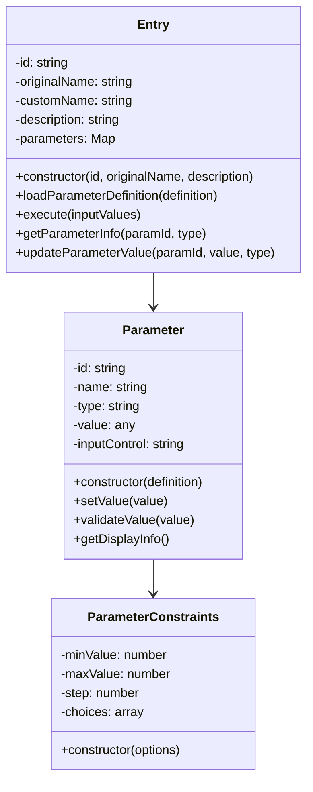
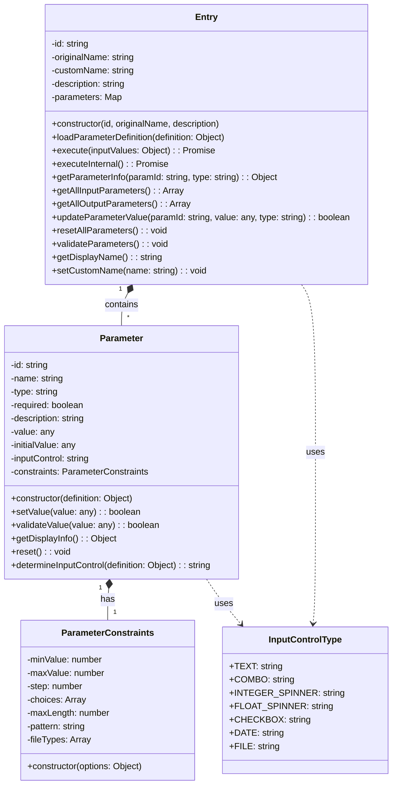
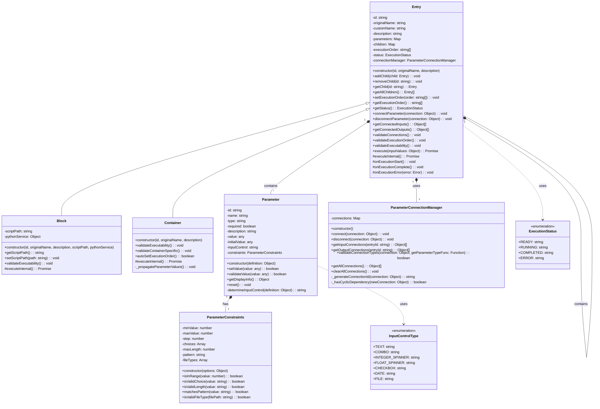

# ベースクラスの実装計画

## 1. 概要と目的

FlowBuilderのベースとなるクラス群を実装します。これらのクラスは、フローの各要素（ブロックやコンテナ）の基本機能を提供し、パラメータの管理とGUIでの表示・編集を可能にします。

### 主な機能
- XMLからのパラメータ定義の読み込み
- パラメータの型に応じたGUIコントロールの提供
- パラメータ値の検証と管理
- 実行機能の基本フレームワーク

## 2. クラス構成



## 3. 各クラスの詳細

### 3.1 InputControlType

パラメータの入力方法を定義する定数群です。

```javascript
export const InputControlType = {
    TEXT: 'text',           // テキストボックス
    COMBO: 'combo',         // コンボボックス
    INTEGER_SPINNER: 'integer-spinner',  // 整数用スピンボタン
    FLOAT_SPINNER: 'float-spinner',      // 実数用スピンボタン
    CHECKBOX: 'checkbox',   // チェックボックス
    DATE: 'date',          // 日付選択
    FILE: 'file',          // ファイル選択
};
```

### 3.2 ParameterConstraints

パラメータの制約条件を管理するクラスです。

#### プロパティ
- minValue: 数値の最小値
- maxValue: 数値の最大値
- step: 数値の増減ステップ
- choices: 選択肢の配列
- maxLength: 文字列の最大長
- pattern: 入力パターン（正規表現）
- fileTypes: 許可するファイル拡張子

#### メソッド
- constructor(options): 制約情報の初期化

### 3.3 Parameter

個々のパラメータを表現するクラスです。

#### プロパティ
- id: パラメータの一意のID
- name: パラメータ名
- type: データ型
- required: 必須かどうか
- description: 説明
- value: 現在の値
- initialValue: 初期値
- inputControl: GUI入力コントロールの種類
- constraints: パラメータの制約情報

#### メソッド
- constructor(definition): パラメータの初期化
- setValue(value): 値の設定
- validateValue(value): 値の検証
- getDisplayInfo(): GUI表示用の情報取得
- reset(): 値を初期値に戻す
- determineInputControl(definition): 入力コントロールの種類を決定

### 3.4 Entry

フローの要素の基本クラスです。

#### プロパティ
- id: 要素の一意のID
- originalName: オリジナルの名称
- customName: カスタム名称
- description: 説明
- parameters: 入力/出力パラメータのマップ

#### メソッド
- constructor(id, originalName, description): 初期化
- loadParameterDefinition(definition): パラメータ定義の読み込み
- execute(inputValues): 実行
- executeInternal(): 実際の処理（サブクラスで実装）
- getParameterInfo(paramId, type): パラメータ情報の取得
- getAllInputParameters(): 全入力パラメータの取得
- getAllOutputParameters(): 全出力パラメータの取得
- updateParameterValue(paramId, value, type): パラメータ値の更新
- resetAllParameters(): 全パラメータのリセット
- validateParameters(): パラメータのバリデーション

## 4. XMLフォーマット

パラメータ定義のXMLフォーマットは以下の構造とします：

```xml
<parameters>
    <inputs>
        <parameter id="param1" name="温度" type="float">
            <description>設定温度</description>
            <constraints>
                <minValue>-273.15</minValue>
                <maxValue>1000</maxValue>
                <step>0.1</step>
            </constraints>
        </parameter>
        <parameter id="param2" name="モード" type="string">
            <description>動作モード</description>
            <constraints>
                <choices>
                    <choice>通常モード</choice>
                    <choice>省エネモード</choice>
                    <choice>高速モード</choice>
                </choices>
            </constraints>
        </parameter>
    </inputs>
    <outputs>
        <parameter id="result1" name="計算結果" type="float">
            <description>処理結果</description>
        </parameter>
    </outputs>
</parameters>
```

## 5. 使用例

```javascript
// Entryクラスのインスタンス化
const entry = new Entry('block1', '温度変換', '温度の単位を変換します');

// XMLからパラメータ定義を読み込み
const definition = loadXMLDefinition('temperature-converter.xml');
entry.loadParameterDefinition(definition);

// GUIでの表示用にパラメータ情報を取得
const inputParams = entry.getAllInputParameters();
// => [{id: 'param1', name: '温度', type: 'float', ...}, ...]

// パラメータ値の更新（GUIからの入力）
entry.updateParameterValue('param1', 25.0, 'inputs');

// 実行
const result = await entry.execute({
    param1: 25.0,
    param2: '通常モード'
});
```

## 6. 詳細クラス図



## 7. リスコフの置換原則に基づく追加機能

BlockクラスとContainerクラスの要件を満たすために、Entryクラスに以下の機能を追加する必要があります：

### 7.1 子要素の管理機能

```typescript
class Entry {
    // 子要素を保持
    protected children: Map<string, Entry>;
    
    // 子要素の管理メソッド
    addChild(child: Entry): void;
    removeChild(id: string): void;
    getChild(id: string): Entry;
    getAllChildren(): Entry[];
}
```

### 7.2 実行順序の制御機能

```typescript
class Entry {
    // 実行順序の管理
    protected executionOrder: string[];
    
    // 実行順序の制御メソッド
    setExecutionOrder(order: string[]): void;
    getExecutionOrder(): string[];
}
```

### 7.3 実行状態の管理機能

```typescript
enum ExecutionStatus {
    READY = 'ready',
    RUNNING = 'running',
    COMPLETED = 'completed',
    ERROR = 'error'
}

class Entry {
    // 実行状態の管理
    protected status: ExecutionStatus;
    
    // 状態管理メソッド
    getStatus(): ExecutionStatus;
    protected onExecutionStart(): void;
    protected onExecutionComplete(): void;
    protected onExecutionError(error: Error): void;
}
```

### 7.4 パラメータ連携機能

```typescript
interface ParameterConnection {
    sourceEntryId: string;      // 接続元のEntry ID
    sourceParameterId: string;  // 接続元のパラメータID
    targetEntryId: string;      // 接続先のEntry ID
    targetParameterId: string;  // 接続先のパラメータID
}

class ParameterConnectionManager {
    // パラメータ接続を管理
    private connections: Map<string, ParameterConnection>;
    
    // 接続管理メソッド
    connect(connection: ParameterConnection): void;
    disconnect(connection: ParameterConnection): void;
    getInputConnections(entryId: string): ParameterConnection[];
    getOutputConnections(entryId: string): ParameterConnection[];
    validateConnectionTypes(connection: ParameterConnection): boolean;
}

class Entry {
    // パラメータ連携機能
    protected connectionManager: ParameterConnectionManager;
    
    // パラメータ連携メソッド
    connectParameter(connection: ParameterConnection): void;
    disconnectParameter(connection: ParameterConnection): void;
    getConnectedInputs(): ParameterConnection[];
    getConnectedOutputs(): ParameterConnection[];
}
```

### 7.5 実行前の検証機能

```typescript
class Entry {
    // パラメータ接続の検証
    validateConnections(): void {
        // 型の互換性チェック
        // 未接続の必須パラメータのチェック
    }

    // 実行順序の検証
    validateExecutionOrder(): void {
        // トポロジカルソートによる依存関係チェック
        // 循環参照のチェック
    }

    // 実行可能性の検証
    validateExecutability(): void {
        // リソースの検証
        // パラメータ値の検証
    }

    // コンテナ固有の検証
    validateContainerSpecific(): void {
        // 子要素間の関係の検証
        // 実行順序の完全性チェック
    }
}
```

### 7.6 実装後のクラス図



## 8. 今後の拡張性

1. **パラメータタイプの拡張**
   - 新しいデータ型の追加
   - カスタム入力コントロールの追加

2. **バリデーション機能の拡張**
   - カスタムバリデーションルールの追加
   - 複数パラメータ間の相関チェック

3. **実行機能の拡張**
   - 非同期処理のサポート強化
   - エラーハンドリングの拡充
   - 実行状態の監視機能

4. **GUI連携の拡張**
   - リアルタイムプレビュー
   - パラメータ間の依存関係の表現
   - カスタムレンダリング
