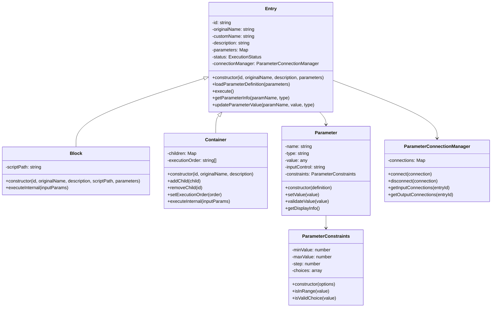
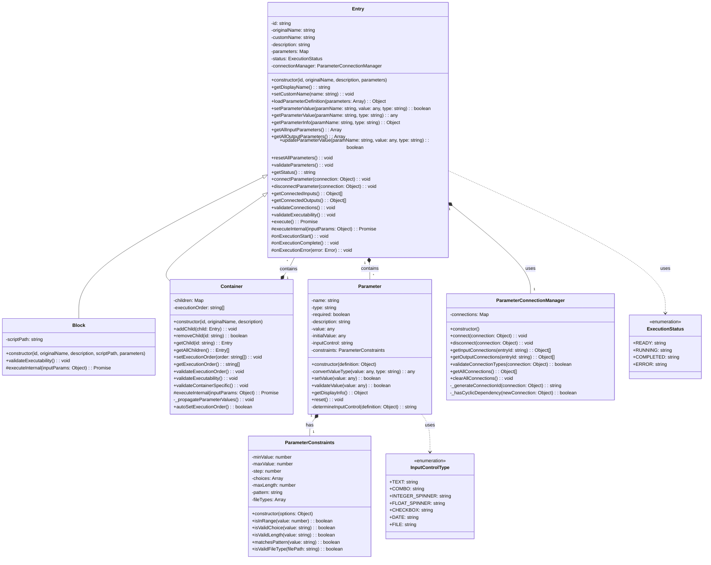

# ベースクラスの実装計画

## 1. 概要と目的

FlowBuilderのベースとなるクラス群を実装します。これらのクラスは、フローの各要素（ブロックやコンテナ）の基本機能を提供し、パラメータの管理とGUIでの表示・編集を可能にします。

### 主な機能
- パラメータ定義の読み込みと管理
- パラメータの型に応じたGUIコントロールの提供
- パラメータ値の検証と管理
- 実行機能の基本フレームワーク
- パラメータ間の接続管理
- 実行状態の管理

## 2. クラス構成



## 3. 各クラスの詳細

### 3.1 InputControlType

パラメータの入力方法を定義する定数群です。

```javascript
export const InputControlType = {
    /** テキストボックス - 一般的なテキスト入力 */
    TEXT: 'text',
    
    /** コンボボックス - 選択肢からの選択 */
    COMBO: 'combo',
    
    /** 整数用スピンボタン - 整数値の入力 */
    INTEGER_SPINNER: 'integer-spinner',
    
    /** 実数用スピンボタン - 小数点を含む数値の入力 */
    FLOAT_SPINNER: 'float-spinner',
    
    /** チェックボックス - 真偽値の入力 */
    CHECKBOX: 'checkbox',
    
    /** 日付選択 - 日付の入力 */
    DATE: 'date',
    
    /** ファイル選択 - ファイルパスの入力 */
    FILE: 'file'
};
```

### 3.2 ExecutionStatus

実行状態を表す列挙型です。

```javascript
export const ExecutionStatus = {
    /** 実行準備完了 */
    READY: 'ready',
    
    /** 実行中 */
    RUNNING: 'running',
    
    /** 実行完了 */
    COMPLETED: 'completed',
    
    /** エラー発生 */
    ERROR: 'error'
};
```

### 3.3 ParameterConstraints

パラメータの制約条件を管理するクラスです。

#### プロパティ
- minValue: 数値の最小値
- maxValue: 数値の最大値
- step: 数値の増減ステップ
- choices: 選択肢の配列
- maxLength: 文字列の最大長
- pattern: 入力パターン（正規表現）
- fileTypes: 許可するファイル拡張子

#### メソッド
- constructor(options): 制約情報の初期化
- isInRange(value): 数値が範囲内かどうかを検証
- isValidChoice(value): 選択肢に含まれるかどうかを検証
- isValidLength(value): 文字列の長さが制約を満たすかどうかを検証
- matchesPattern(value): 文字列がパターンに一致するかどうかを検証
- isValidFileType(filePath): ファイル拡張子が許可されているかどうかを検証

### 3.4 Parameter

個々のパラメータを表現するクラスです。

#### プロパティ
- name: パラメータ名
- type: データ型
- required: 必須かどうか
- description: 説明
- value: 現在の値
- initialValue: 初期値
- inputControl: GUI入力コントロールの種類
- constraints: パラメータの制約情報

#### メソッド
- constructor(definition): パラメータの初期化
- convertValueType(value, type): 値を適切な型に変換
- setValue(value): 値の設定
- validateValue(value): 値の検証
- getDisplayInfo(): GUI表示用の情報取得
- reset(): 値を初期値に戻す
- determineInputControl(definition): 入力コントロールの種類を決定

### 3.5 ParameterConnectionManager

パラメータ接続を管理するクラスです。

#### プロパティ
- connections: パラメータ接続を保持するマップ

#### メソッド
- constructor(): 初期化
- connect(connection): パラメータを接続
- disconnect(connection): パラメータの接続を解除
- getInputConnections(entryId): 特定のEntryの入力パラメータに接続している出力パラメータを取得
- getOutputConnections(entryId): 特定のEntryの出力パラメータが接続している入力パラメータを取得
- validateConnectionTypes(connection): パラメータの型の互換性をチェック
- _hasCyclicDependency(newConnection): 循環参照をチェック
- getAllConnections(): すべての接続を取得
- clearAllConnections(): すべての接続を削除

### 3.6 Entry

フローの要素の基本クラスです。

#### プロパティ
- id: 要素の一意のID
- originalName: オリジナルの名称
- customName: カスタム名称
- description: 説明
- parameters: 入力/出力パラメータのマップ
- status: 実行状態
- connectionManager: パラメータ接続マネージャ

#### メソッド
- constructor(id, originalName, description, parameters): 初期化
- getDisplayName(): 表示用の名称を取得
- setCustomName(name): カスタム名を設定
- loadParameterDefinition(parameters): パラメータ定義を取り込む
- setParameterValue(paramName, value, type): パラメータの値を設定
- getParameterValue(paramName, type): パラメータの値を取得
- getParameterInfo(paramName, type): 特定のパラメータの情報を取得
- getAllInputParameters(): すべての入力パラメータの情報を取得
- getAllOutputParameters(): すべての出力パラメータの情報を取得
- updateParameterValue(paramName, value, type): パラメータの値を更新
- resetAllParameters(): すべてのパラメータを初期値にリセット
- validateParameters(): パラメータのバリデーション
- getStatus(): 実行状態を取得
- connectParameter(connection): パラメータを接続
- disconnectParameter(connection): パラメータの接続を解除
- getConnectedInputs(): 接続された入力パラメータを取得
- getConnectedOutputs(): 接続された出力パラメータを取得
- validateConnections(): パラメータ接続の検証
- validateExecutability(): 実行可能性の検証
- onExecutionStart(): 実行開始時の処理
- onExecutionComplete(): 実行完了時の処理
- onExecutionError(error): 実行エラー時の処理
- execute(): 実行メソッド
- executeInternal(inputParams): 実際の実行処理（サブクラスで実装）

### 3.7 Block

スクリプトを実行するクラスです。

#### プロパティ
- scriptPath: 実行するスクリプトのパス

#### メソッド
- constructor(id, originalName, description, scriptPath, parameters): 初期化
- validateExecutability(): 実行可能性の検証
- executeInternal(inputParams): 実際の実行処理

### 3.8 Container

子要素を順次実行するクラスです。

#### プロパティ
- children: 子要素を保持するマップ
- executionOrder: 実行順序を保持する配列

#### メソッド
- constructor(id, originalName, description): 初期化
- addChild(child): 子要素を追加
- removeChild(id): 子要素を削除
- getChild(id): 子要素を取得
- getAllChildren(): すべての子要素を取得
- setExecutionOrder(order): 実行順序を設定
- getExecutionOrder(): 実行順序を取得
- validateExecutionOrder(): 実行順序の検証
- validateExecutability(): 実行可能性の検証
- validateContainerSpecific(): コンテナ固有の検証
- _propagateParameterValues(): 子要素間のパラメータ値の伝播
- executeInternal(inputParams): 実際の実行処理
- autoSetExecutionOrder(): 子要素の実行順序を自動設定

## 4. パラメータ定義の形式

パラメータ定義は以下の形式のオブジェクトとして渡されます：

```javascript
const parameterDefinition = {
    name: "温度",           // パラメータ名
    type: "float",          // データ型
    prmType: "input",       // 'input'または'output'
    required: true,         // 必須かどうか
    description: "設定温度", // 説明
    value: 25.0,            // 初期値
    inputControl: "float-spinner", // 入力コントロールの種類（省略可）
    constraints: {          // 制約条件（省略可）
        minValue: -273.15,  // 最小値
        maxValue: 1000,     // 最大値
        step: 0.1           // 増減ステップ
    }
};
```

## 5. 使用例

### 5.1 Blockの使用例

```javascript
// Blockクラスのインスタンス化
const parameters = [
    {
        name: "temperature",
        type: "float",
        prmType: "input",
        required: true,
        description: "入力温度",
        value: 25.0,
        constraints: {
            minValue: -273.15,
            maxValue: 1000,
            step: 0.1
        }
    },
    {
        name: "result",
        type: "float",
        prmType: "output",
        description: "変換結果",
        value: null
    }
];

const block = new Block(
    'temp-converter',
    '温度変換',
    '温度の単位を変換します',
    'python_scripts/temperature_converter.py',
    parameters
);

// パラメータ値の更新
block.updateParameterValue('temperature', 30.0, 'inputs');

// 実行
try {
    await block.execute();
    const result = block.getParameterValue('result', 'outputs');
    console.log(`変換結果: ${result}`);
} catch (error) {
    console.error(`実行エラー: ${error.message}`);
}
```

### 5.2 Containerの使用例

```javascript
// Containerクラスのインスタンス化
const container = new Container(
    'process-flow',
    '処理フロー',
    '複数の処理を順次実行します'
);

// 子要素の追加
container.addChild(block1);
container.addChild(block2);

// パラメータ接続の設定
container.connectParameter({
    sourceEntryId: 'block1',
    sourceParameterId: 'result',
    targetEntryId: 'block2',
    targetParameterId: 'input'
});

// 実行順序の設定
container.setExecutionOrder(['block1', 'block2']);

// 実行
try {
    await container.execute();
    console.log('処理フローの実行が完了しました');
} catch (error) {
    console.error(`実行エラー: ${error.message}`);
}
```

## 6. 詳細クラス図



## 7. 実装の特徴

### 7.1 パラメータ管理

- パラメータは名前（name）で識別され、入力（inputs）と出力（outputs）に分類されます
- パラメータの型に応じて適切な入力コントロールが自動的に決定されます
- 各パラメータには制約条件を設定でき、値の検証に使用されます

### 7.2 実行フロー

- 実行状態（READY, RUNNING, COMPLETED, ERROR）を管理します
- 実行前に各種検証（パラメータ、接続、実行可能性）を行います
- エラーハンドリングが組み込まれています

### 7.3 パラメータ接続

- 異なるEntry間でパラメータを接続できます
- 循環参照のチェック機能があります
- 接続に基づいて値を伝播します

### 7.4 コンテナ機能

- 子要素を管理し、順次実行します
- 実行順序を手動または自動（トポロジカルソート）で設定できます
- 子要素間のパラメータ値の伝播を行います

## 8. 今後の拡張性

1. **パラメータタイプの拡張**
   - 新しいデータ型の追加
   - カスタム入力コントロールの追加

2. **バリデーション機能の拡張**
   - カスタムバリデーションルールの追加
   - 複数パラメータ間の相関チェック

3. **実行機能の拡張**
   - 非同期処理のサポート強化
   - エラーハンドリングの拡充
   - 実行状態の監視機能

4. **GUI連携の拡張**
   - リアルタイムプレビュー
   - パラメータ間の依存関係の表現
   - カスタムレンダリング

5. **パラメータ接続の拡張**
   - 型変換機能の追加
   - 条件付き接続の実装
   - 複数入力/出力の管理
