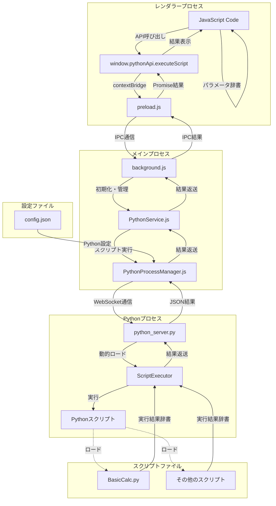

# Python実行アーキテクチャ

## 概要

FlowBuilderアプリケーションにおいて、ブロックやコンテナに対応するPythonスクリプトを実行するためのアーキテクチャ図と説明です。JavaScriptからPythonスクリプトを安全に実行するための仕組みを提供します。

## アーキテクチャ図



## コンポーネントの説明

### 1. window.pythonApi.executeScript()

- **役割**: レンダラープロセス向けのJavaScript API
- **機能**:
  - Pythonスクリプトの実行要求
  - パラメータ辞書の受け渡し
  - 実行結果の取得
- **場所**: contextBridge経由で公開

#### API仕様

```javascript
window.pythonApi.executeScript(scriptName, params)
```

**パラメータ:**
- `scriptName` (string): 実行するPythonスクリプト名（.py拡張子は省略可能）
- `params` (Object): スクリプトに渡すパラメータ辞書（オプション、デフォルト: {}）

**戻り値:**
- `Promise<any>`: スクリプトの実行結果を含むPromise

#### 使用例

```javascript
// 基本的な計算スクリプトの実行
const result = await window.pythonApi.executeScript('BasicCalc', {
  operation: 'add',
  a: 10,
  b: 5
});

// 結果の確認
if (result.result) {
  console.log('計算結果:', result.Decimal);
} else {
  console.error('計算に失敗しました');
}

// エラーハンドリング付きの実行
try {
  const result = await window.pythonApi.executeScript('BasicCalc', {
    operation: 'div',
    a: 20,
    b: 4
  });
  
  if (result.result) {
    console.log('除算結果:', result.Decimal);
  }
} catch (error) {
  console.error('スクリプト実行エラー:', error);
}
```

### 2. preload.js

- **役割**: レンダラープロセスとメインプロセス間の安全な橋渡し
- **機能**:
  - contextBridgeによる安全なAPI公開
  - IPC通信の抽象化
  - セキュリティ境界の維持
  - `window.pythonApi.executeScript()`のグローバル公開
- **場所**: `src/preload.js`

#### API公開の仕組み

preload.jsは、contextBridgeを使用して`window.pythonApi.executeScript()`をレンダラープロセスのグローバルスコープに安全に公開します：

```javascript
// preload.js内の実装
const { contextBridge, ipcRenderer } = require('electron')

contextBridge.exposeInMainWorld('pythonApi', {
  executeScript: (scriptName, params = {}) => {
    return ipcRenderer.invoke('execute-python-script', scriptName, params)
  }
})
```

**重要なポイント:**

1. **import文不要**: レンダラープロセス（Vue.jsコンポーネント等）では、特別なimport文なしに直接`window.pythonApi.executeScript()`を使用可能

2. **グローバルアクセス**: 以下の方法でアクセス可能
   ```javascript
   // 完全な形式
   window.pythonApi.executeScript('BasicCalc', params)
   
   // windowは省略可能
   pythonApi.executeScript('BasicCalc', params)
   ```

3. **Vue.jsコンポーネント内での使用例**:
   ```javascript
   // BlockMain.vue などのコンポーネント内
   export default {
     methods: {
       async executePythonScript() {
         try {
           const result = await window.pythonApi.executeScript('BasicCalc', {
             operation: 'add',
             a: 10,
             b: 5
           });
           
           if (result.result) {
             console.log('計算結果:', result.Decimal);
           }
         } catch (error) {
           console.error('エラー:', error);
         }
       }
     }
   }
   ```

4. **TypeScript使用時の型定義**:
   ```typescript
   // types/global.d.ts
   declare global {
     interface Window {
       pythonApi: {
         executeScript: (scriptName: string, params?: any) => Promise<any>;
       };
     }
   }
   ```

5. **セキュリティ**: contextBridgeにより、レンダラープロセスからの直接的なNode.js APIアクセスを防止し、制限されたAPIのみを安全に公開

### 3. background.js

- **役割**: Electronアプリケーションのメインプロセス
- **機能**:
  - PythonServiceの初期化と管理
  - IPC通信のハンドリング（`execute-python-script`チャンネル）
  - アプリケーションのライフサイクル管理
  - アプリ終了時のPythonサービス停止
- **場所**: `src/background.js`

### 4. PythonService.js

- **役割**: シングルトンサービス
- **機能**:
  - スクリプトディレクトリの管理（`python_scripts/`）
  - PythonProcessManagerの管理
  - スクリプト実行の抽象化
  - スクリプトディレクトリの自動作成
- **場所**: `src/services/PythonService.js`

### 5. PythonProcessManager.js

- **役割**: Pythonプロセスの管理
- **機能**:
  - config.jsonからのPython実行パス設定読み込み
  - Pythonプロセス(python_server.py)の起動と管理
  - WebSocket通信の確立（localhost:8765）
  - スクリプト実行リクエストの送信
  - プロセスのライフサイクル管理
- **場所**: `src/services/PythonProcessManager.js`

#### config.json設定例

```json
{
  "pythonDirPath": "C:/Python39",
  "pythonServerPath": "python_server.py"
}
```

**設定項目の説明:**
- `pythonDirPath`: Pythonインタプリタが配置されているディレクトリの絶対パス
- `pythonServerPath`: python_server.pyファイルのパス（相対パスまたは絶対パス）

**設定例:**
```json
{
  "pythonDirPath": "C:/Python39",
  "pythonServerPath": "python_server.py"           // プロジェクトルート相対
}
```

```json
{
  "pythonDirPath": "C:/Python39",
  "pythonServerPath": "./scripts/python_server.py" // サブディレクトリ
}
```

```json
{
  "pythonDirPath": "C:/Python39",
  "pythonServerPath": "C:/MyScripts/python_server.py" // 絶対パス
}
```

**後方互換性:**
- 旧設定名`pythonDir`も一時的にサポートされますが、警告が表示されます
- 新しいプロジェクトでは`pythonDirPath`を使用してください

### 6. python_server.py

- **役割**: WebSocketサーバー
- **機能**:
  - WebSocketサーバーの起動（localhost:8765）
  - スクリプトの動的ロードと実行
  - 実行結果のJSON形式での返送
  - セキュリティバリデーション
  - エラーハンドリング
- **場所**: `python_server.py`

### 7. ScriptExecutor

- **役割**: Pythonスクリプトの実行エンジン
- **機能**:
  - スクリプトパスのバリデーション
  - 動的モジュールロード
  - `execute()`メソッドの呼び出し
  - セキュリティチェック
- **場所**: `python_server.py`内のクラス

### 8. Pythonスクリプト

- **役割**: 実行可能なスクリプト
- **機能**:
  - 特定の処理の実行
  - パラメータ辞書の受け取り
  - 結果辞書の返却
- **場所**: `python_scripts/`ディレクトリ内
  - `BasicCalc.py`: 基本的な計算機能の提供

#### Pythonスクリプトの実装例（BasicCalc.py）

```python
def execute(paramDict):
    """
    指定された演算を実行する
    
    @param paramDict: パラメータを含む辞書
        - operation: 演算子（'add', 'sub', 'mul', 'div'）
        - a: 第一オペランド
        - b: 第二オペランド
    @return: 演算結果を含む辞書
        - result: 成功/失敗フラグ（bool）
        - Decimal: 計算結果（float）
    """
    returnDict = {"result": False}
    
    try:
        ope = paramDict.get("operation")
        a = paramDict.get("a")
        b = paramDict.get("b")

        if None in [ope, a, b]:
            return returnDict
        
        if ope == "add":
            res = a + b
        elif ope == "sub":
            res = a - b
        elif ope == "mul":
            res = a * b
        elif ope == "div":
            if b == 0:
                raise ValueError("Division by zero is not allowed")
            res = a / b
        else:
            return returnDict
        
        returnDict["Decimal"] = float(res)
        returnDict["result"] = True
        
    except Exception as e:
        print(f"Exception: {e}")
    
    return returnDict
```

## 通信フロー

1. JavaScriptコードから`window.pythonApi.executeScript(scriptName, params)`を呼び出し
2. contextBridge経由でpreload.jsのAPIが実行される
3. preload.jsがIPC通信（`execute-python-script`チャンネル）でメインプロセスに実行要求を送信
4. background.jsがIPC要求を受け取り、PythonService.jsに処理を委譲
5. PythonService.jsがPythonProcessManager.jsを使用してスクリプト実行を要求
6. PythonProcessManager.jsがWebSocket通信でpython_server.pyにスクリプト実行要求を送信
7. python_server.pyのScriptExecutorが指定されたスクリプトを動的にロードして実行
8. Pythonスクリプトの`execute(paramDict)`メソッドが実行され、結果辞書を返却
9. 実行結果が逆の経路でJavaScriptコードに返送され、Promiseとして解決

## セキュリティ考慮事項

- **contextBridge**: レンダラープロセスからの安全なAPI公開
- **スクリプト制限**: 実行は指定されたディレクトリ（`python_scripts/`）内のみに制限
- **WebSocket制限**: 接続はローカルホスト（localhost:8765）のみに制限
- **パスバリデーション**: スクリプトパスの厳密なバリデーションを実施
- **ファイル権限**: スクリプトファイルの読み取り権限チェック
- **エラーハンドリング**: 適切なエラーハンドリングとログ記録
- **プロセス分離**: PythonプロセスとElectronプロセスの分離

## 拡張性

このアーキテクチャは以下の点で拡張可能です：

1. **新しいPythonスクリプトの追加**: `python_scripts/`ディレクトリに新しい`.py`ファイルを追加するだけで利用可能
2. **パラメータの拡張**: パラメータ辞書の構造を自由に拡張可能
3. **並列処理**: 複数のスクリプトを同時実行する機能の追加が可能
4. **モニタリング**: 実行状況の監視機能の追加が可能
5. **キャッシュ機能**: スクリプト実行結果のキャッシュ機能の追加が可能
6. **設定の拡張**: config.jsonを通じた詳細な設定オプションの追加が可能

## トラブルシューティング

### よくある問題と解決方法

1. **Pythonが見つからない**
   - config.jsonでpythonDirを正しく設定する
   - Pythonのインストール状況を確認する

2. **WebSocket接続エラー**
   - ポート8765が使用可能か確認する
   - ファイアウォール設定を確認する

3. **スクリプト実行エラー**
   - スクリプトファイルの存在と権限を確認する
   - スクリプト内の`execute()`メソッドの実装を確認する

4. **パラメータエラー**
   - 渡すパラメータの型と構造を確認する
   - スクリプト側でのパラメータ検証を実装する
