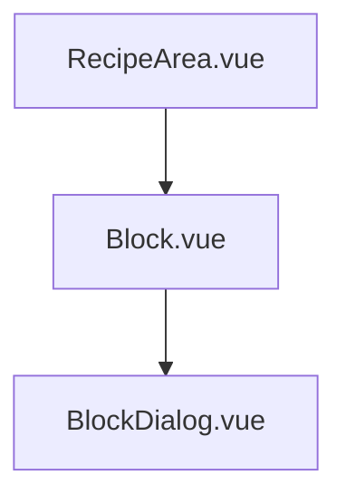
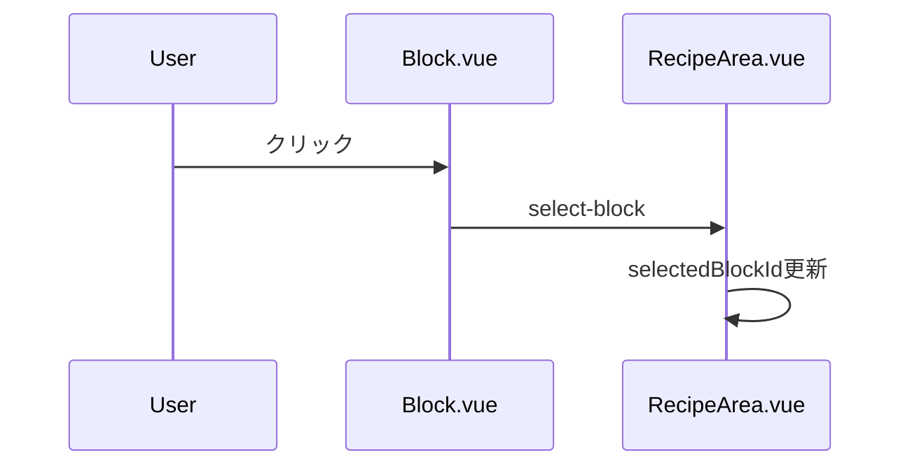
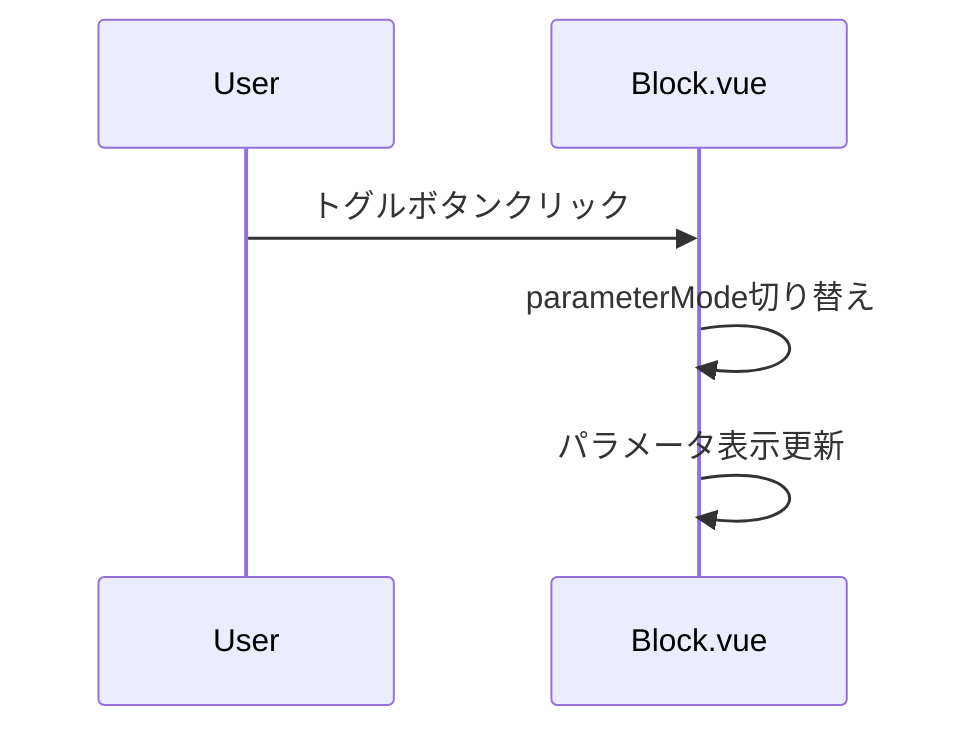
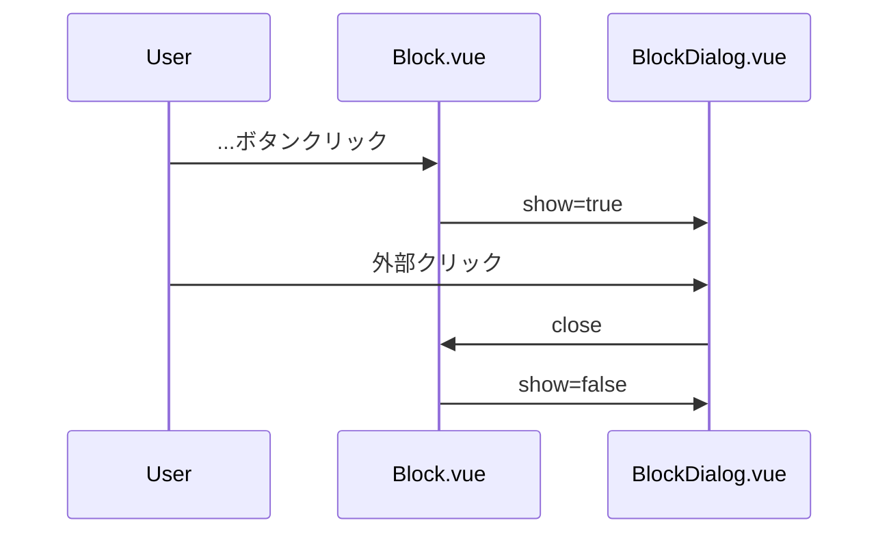
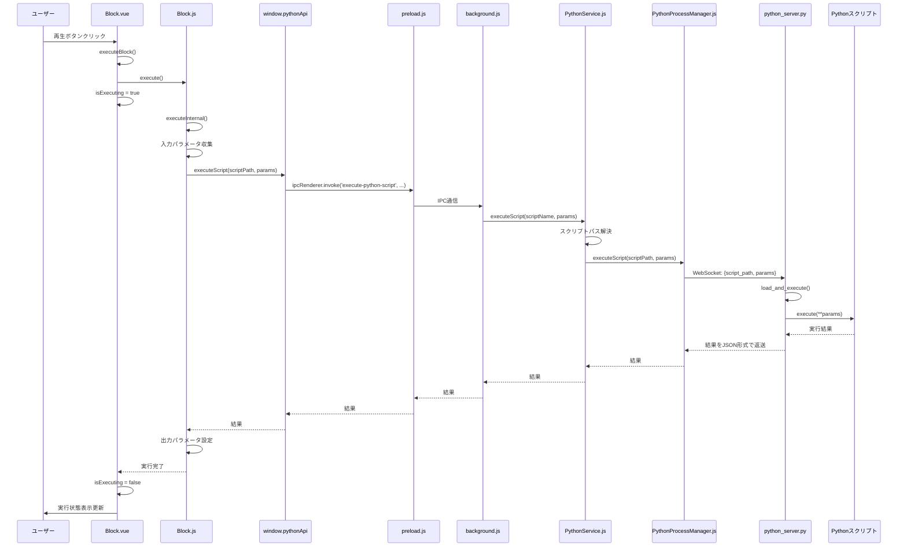

# ブロックGUI実装計画

## 1. 概要
RecipeArea.vueにドロップされたブロックの表示機能を実装する。

## 2. 要件
- ブロックがドロップされると、Block.jsで定義されているBlockクラスのインスタンスが生成され、対応するブロック矩形が表示される
- ブロック矩形の表示機能：
  1. 非選択時：「ブロック名」、「ブロック削除ボタン」を表示
  2. 選択時：ブロックの横幅が右方向に拡張され、以下を表示
     - 「ブロック名」
     - 「ブロック再生ボタン」
     - 「ブロック削除ボタン」
     - 「入力/出力パラメータ表示切替トグルボタン」
     - 「パラメータ名1」、「パラメータ名2」...
  3. 「入力/出力パラメータ表示切替トグルボタン」で、選択状態のブロック矩形に表示される各パラメータの入力/出力を切り替え
  4. ブロック選択状態で規定幅に全内容が表示しきれない場合、パラメータ関連の代わりに「...ボタン」を表示
  5. 「...ボタン」クリックでパラメータ一覧ダイアログを表示。「...ボタン」または他の要素クリックで非表示
  6. ブロック再生ボタンを押すと対応するPythonスクリプトを実行する
  7. ブロック削除ボタンを押すと表示されているブロック矩形を削除し、インスタンスも解放する。

## 3. コンポーネント構成



## 4. 各コンポーネントの実装詳細

### RecipeArea.vue の修正
```vue
- ドロップ時にBlockクラスのインスタンスを生成
- Block.vueコンポーネントの配置
- ブロック選択状態の管理（selectedBlockId）

data() {
  return {
    blocks: [], // Blockインスタンスの配列
    selectedBlockId: null
  }
}
```

### Block.vue の新規作成
```vue
props: {
  block: Object,     // Blockインスタンス
  isSelected: Boolean
}

data() {
  return {
    parameterMode: 'input',  // 'input' or 'output'
    showDialog: false,
    isOverflowing: false     // パラメータが表示幅を超えているか
  }
}

表示内容：
- 非選択時
  - ブロック名
  - 削除ボタン
- 選択時
  - ブロック名
  - 再生ボタン
  - 削除ボタン
  - パラメータ表示切替トグル
  - パラメータリスト（または...ボタン）
```

### BlockDialog.vue の新規作成
```vue
props: {
  block: Object,          // Blockインスタンス
  parameterMode: String,  // 'input' or 'output'
  show: Boolean
}

- モーダルダイアログスタイル
- パラメータ一覧表示
- クリックによる非表示
```

## 5. 主な機能の実装フロー

### ブロック選択機能


### パラメータ表示制御


### ダイアログ表示制御


## 6. スタイリング仕様

### Block.vue
```css
.block {
  display: flex;
  align-items: center;
  /* 非選択時は内容に合わせて幅を自動調整 */
  width: fit-content;
  max-width: 800px; /* 選択時の最大幅 */
  transition: width 0.3s; /* 幅変更時のアニメーション */
}
```

### BlockDialog.vue
```css
.block-dialog {
  width: 600px;
  /* パラメータ数に応じて高さを自動調整 */
  max-height: 80vh; /* ビューポートの80%を最大高さとする */
  overflow-y: auto; /* 必要に応じてスクロール可能に */
}
```

## 7. 実装手順

1. RecipeArea.vueの修正
   - Blockクラスのインスタンス生成処理
   - ブロック選択状態の管理

2. Block.vueの作成
   - 基本的なレイアウトと状態管理
   - パラメータ表示制御
   - オーバーフロー検出

3. BlockDialog.vueの作成
   - モーダルダイアログの実装
   - パラメータ一覧表示

## 8. Pythonスクリプト実行フロー

ブロック再生ボタンを押してからPythonスクリプトが実行されるまでの処理フローを以下に示します。



### 処理詳細

1. **ユーザーアクション**
   - ユーザーがBlock.vueコンポーネントの再生ボタンをクリック

2. **フロントエンド処理**
   - Block.vueの`executeBlock()`メソッドが呼び出される
   - 実行状態フラグ`isExecuting`をtrueに設定（ブロック枠の点滅開始）
   - Block.jsインスタンスの`execute()`メソッドを呼び出し

3. **Block.js処理**
   - `executeInternal()`メソッドが実行される
   - 入力パラメータを収集
   - `window.pythonApi.executeScript()`を呼び出し

4. **IPC通信**
   - preload.jsが`ipcRenderer.invoke('execute-python-script', ...)`を実行
   - background.jsのIPCハンドラが呼び出される

5. **バックエンド処理**
   - PythonService.jsの`executeScript()`メソッドが呼び出される
   - スクリプトパスが解決される
   - PythonProcessManager.jsの`executeScript()`メソッドが呼び出される

6. **Python処理**
   - WebSocketを通じてpython_server.pyにリクエスト送信
   - python_server.pyが指定されたスクリプトを動的にロード
   - スクリプトの`execute()`関数がパラメータ付きで実行される

7. **結果返送**
   - 実行結果が逆の経路でBlock.jsに返送される
   - Block.jsが出力パラメータを設定
   - Block.vueの実行状態フラグ`isExecuting`がfalseに設定（ブロック枠の点滅終了）
   - ユーザーに実行状態の変化が視覚的に表示される
