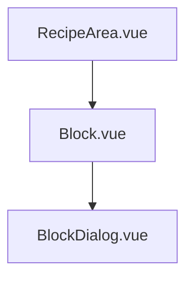
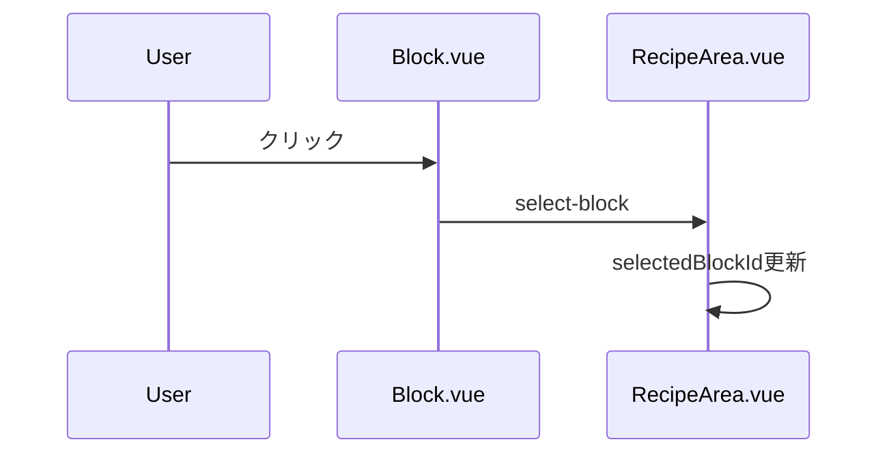
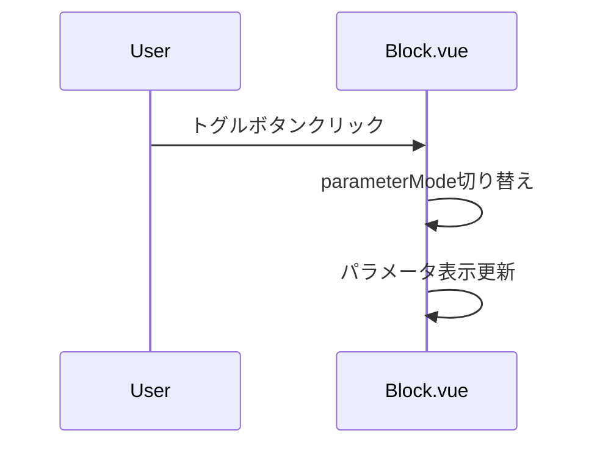
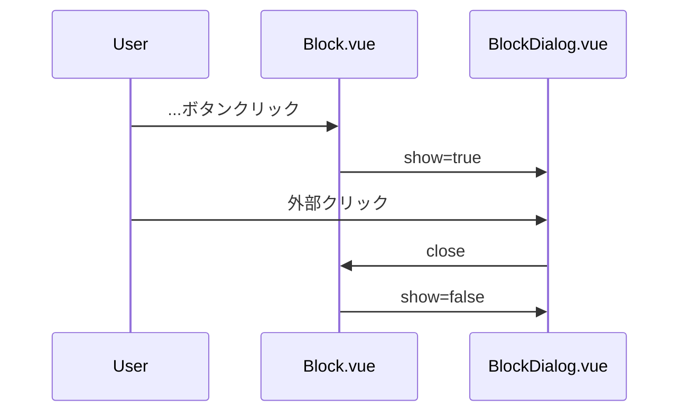

# ブロックGUI実装計画

## 1. 概要
Block.jsで定義されているBlockクラスのインスタンスに対応するGUI上の機能を実装する。

## 2. 要件
- BlockクラスのインスタンスのGUI上の機能：
  1. 非選択時：「ブロック名」、「ブロック削除ボタン」を表示
  2. 選択時：ブロックの横幅が右方向に拡張され、以下を表示
     - 「ブロック名」
     - 「ブロック再生ボタン」
     - 「ブロック削除ボタン」
     - 「入力/出力パラメータ表示切替トグルボタン」
     - 「パラメータ名1」、「パラメータ名2」...
  3. 「入力/出力パラメータ表示切替トグルボタン」で、選択状態のブロック矩形に表示される各パラメータの入力/出力を切り替え
  4. ブロック選択状態で規定幅に全内容が表示しきれない場合、パラメータ関連の代わりに「...ボタン」を表示
  5. 「...ボタン」クリックでパラメータ一覧ダイアログを表示。「...ボタン」または他の要素クリックで非表示

## 3. コンポーネント構成



## 4. 各コンポーネントの実装詳細

### Block.vue の新規作成
```vue
props: {
  block: Object,     // Blockインスタンス
  isSelected: Boolean
}

data() {
  return {
    parameterMode: 'input',  // 'input' or 'output'
    showDialog: false,
    isOverflowing: false     // パラメータが表示幅を超えているか
  }
}

表示内容：
- 非選択時
  - ブロック名
  - 削除ボタン
- 選択時
  - ブロック名
  - 再生ボタン
  - 削除ボタン
  - パラメータ表示切替トグル
  - パラメータリスト（または...ボタン）
```

### BlockDialog.vue の新規作成
```vue
props: {
  block: Object,          // Blockインスタンス
  parameterMode: String,  // 'input' or 'output'
  show: Boolean
}

- モーダルダイアログスタイル
- パラメータ一覧表示
- クリックによる非表示
```

## 5. 主な機能の実装フロー

### ブロック選択機能


### パラメータ表示制御


### ダイアログ表示制御


## 6. スタイリング仕様

### Block.vue
```css
.block {
  display: flex;
  align-items: center;
  /* 非選択時は内容に合わせて幅を自動調整 */
  width: fit-content;
  max-width: 800px; /* 選択時の最大幅 */
  transition: width 0.3s; /* 幅変更時のアニメーション */
}
```

### BlockDialog.vue
```css
.block-dialog {
  width: 600px;
  /* パラメータ数に応じて高さを自動調整 */
  max-height: 80vh; /* ビューポートの80%を最大高さとする */
  overflow-y: auto; /* 必要に応じてスクロール可能に */
}
```

## 7. 実装手順

1. Block.vueの作成
   - 基本的なレイアウトと状態管理
   - パラメータ表示制御
   - オーバーフロー検出

2. BlockDialog.vueの作成
   - モーダルダイアログの実装
   - パラメータ一覧表示
