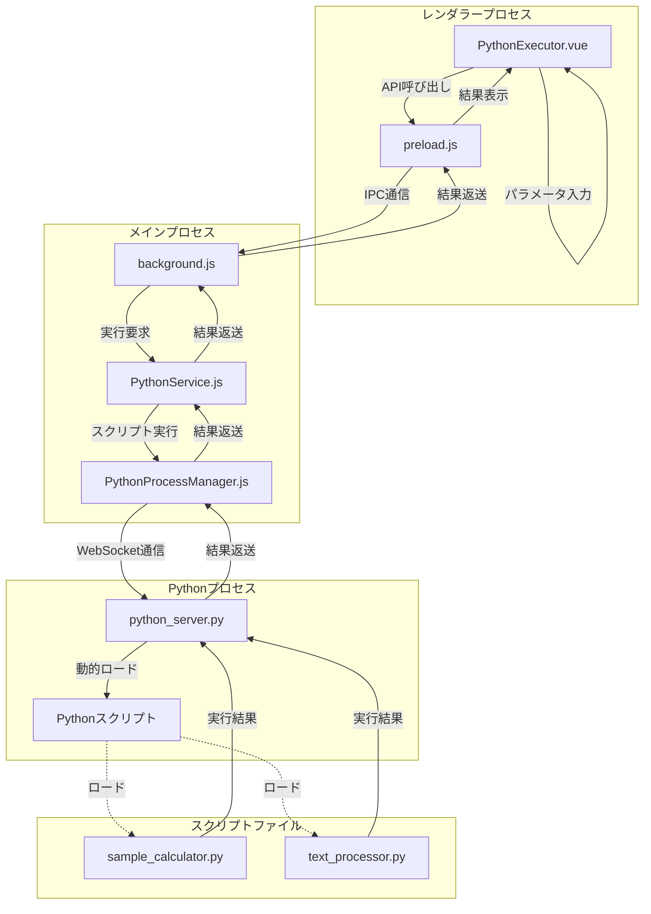

# Pythonサーバーアーキテクチャ

## 概要

FlowBuilderアプリケーションにおいて、ブロックやコンテナに対応するPythonスクリプトを実行するためのサーバーコンポーネントのアーキテクチャ図と説明です。

## アーキテクチャ図

## コンポーネントの説明

### 1. PythonExecutor.vue

- **役割**: ユーザーインターフェース
- **機能**:
  - スクリプト選択と実行
  - パラメータ入力
  - 実行結果の表示
- **場所**: `src/components/PythonExecutor.vue`

### 2. preload.js

- **役割**: レンダラープロセスとメインプロセス間の橋渡し
- **機能**:
  - 安全なIPC通信の提供
  - APIの公開
- **場所**: `src/preload.js`

### 3. background.js

- **役割**: Electronアプリケーションのメインプロセス
- **機能**:
  - PythonServiceの初期化と管理
  - IPC通信のハンドリング
  - アプリケーションのライフサイクル管理
- **場所**: `src/background.js`

### 4. PythonService.js

- **役割**: シングルトンサービス
- **機能**:
  - スクリプトディレクトリの管理
  - PythonProcessManagerの管理
  - スクリプト実行の抽象化
- **場所**: `src/services/PythonService.js`

### 5. PythonProcessManager.js

- **役割**: Pythonプロセスの管理
- **機能**:
  - Pythonプロセスの起動と管理
  - WebSocket通信の確立
  - スクリプト実行リクエストの送信
- **場所**: `src/services/PythonProcessManager.js`

### 6. python_server.py

- **役割**: WebSocketサーバー
- **機能**:
  - スクリプトの動的ロードと実行
  - 実行結果のJSON形式での返送
  - エラーハンドリング
- **場所**: `python_server.py`

### 7. Pythonスクリプト

- **役割**: 実行可能なスクリプト
- **機能**:
  - 特定の処理の実行
  - 結果の返却
- **場所**: `python_scripts/`ディレクトリ内
  - `sample_calculator.py`: 計算機能の提供
  - `text_processor.py`: テキスト処理機能の提供

## 通信フロー

1. ユーザーが`PythonExecutor.vue`コンポーネントでスクリプトとパラメータを選択し、実行ボタンをクリック
2. `preload.js`を通じてメインプロセスにIPC通信で実行要求を送信
3. `background.js`がIPC要求を受け取り、`PythonService.js`に処理を委譲
4. `PythonService.js`が`PythonProcessManager.js`を使用してスクリプト実行を要求
5. `PythonProcessManager.js`がWebSocket通信で`python_server.py`にスクリプト実行要求を送信
6. `python_server.py`が指定されたスクリプトを動的にロードして実行
7. 実行結果が逆の経路で`PythonExecutor.vue`に返送され、画面に表示

## セキュリティ考慮事項

- スクリプトの実行は指定されたディレクトリ内のみに制限
- WebSocket接続はローカルホストのみに制限
- スクリプトパスのバリデーションを実施
- エラーハンドリングと適切なログ記録

## 拡張性

このアーキテクチャは以下の点で拡張可能です：

1. 新しいPythonスクリプトの追加が容易
2. パラメータの種類と数の拡張が可能
3. 並列処理への対応が可能
4. モニタリング機能の追加が可能
